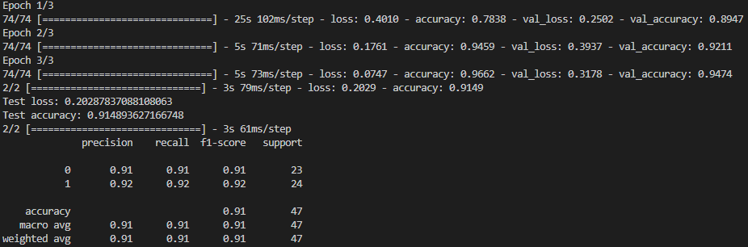

# ChatFraudRecognizer
运用woBERT+CNN+RNN模型对社交媒体聊天诈骗进行识别

项目地址https://github.com/Zhao-Rigel/ChatFraudRecognizer

训练测试结果详情：

bert+cnn:

bert+rnn:

bert+cnn+rnn:

wobert+cnn:

wobert+rnn:

wobert+cnn+rnn:

